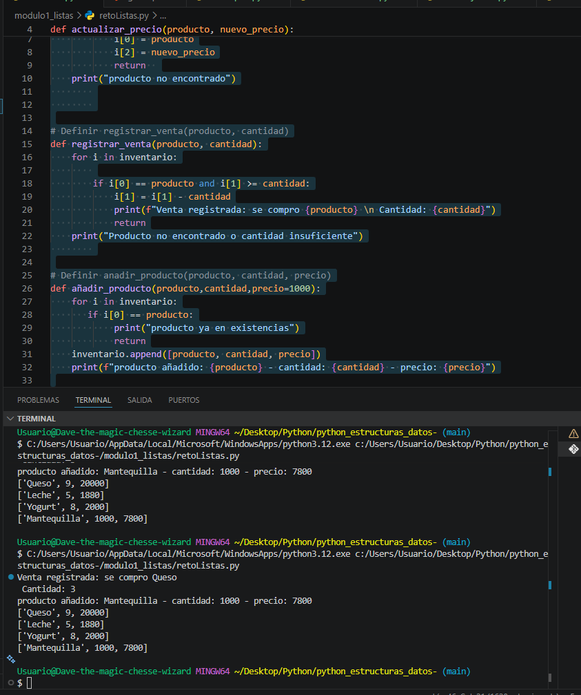
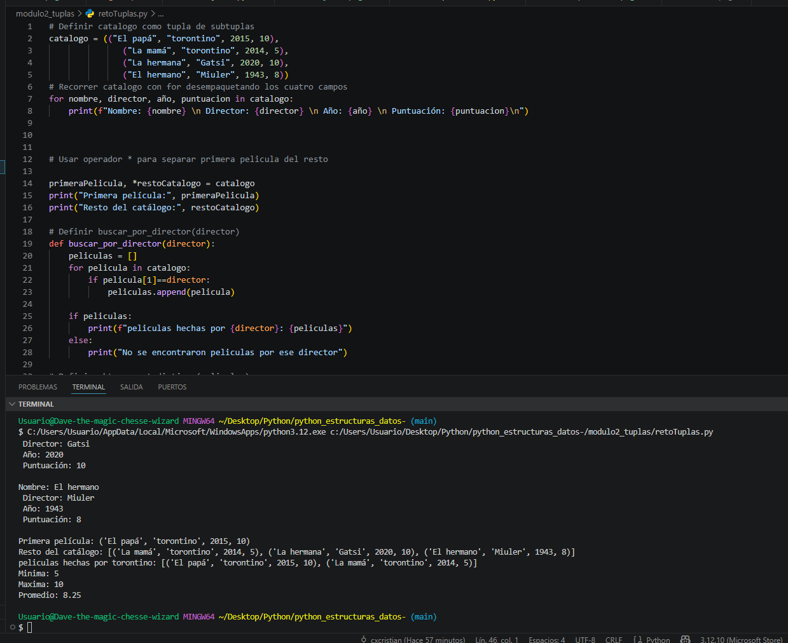
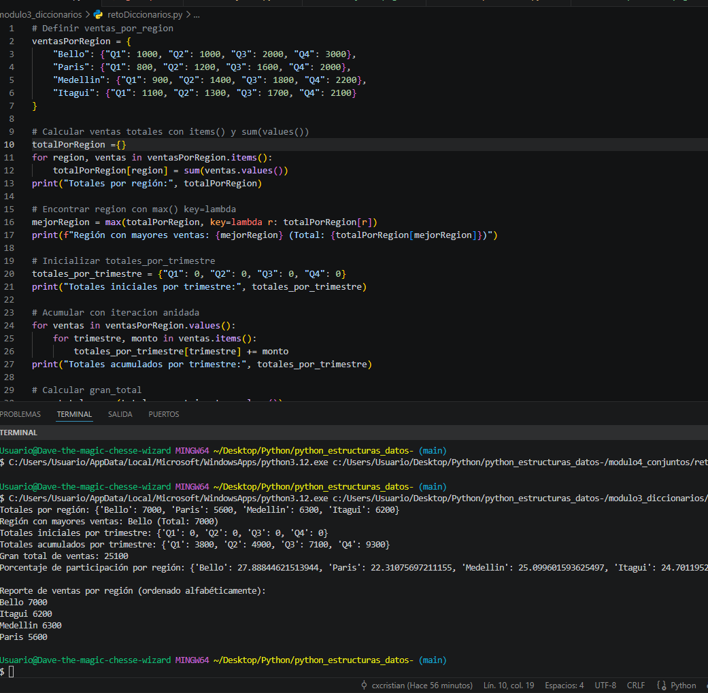
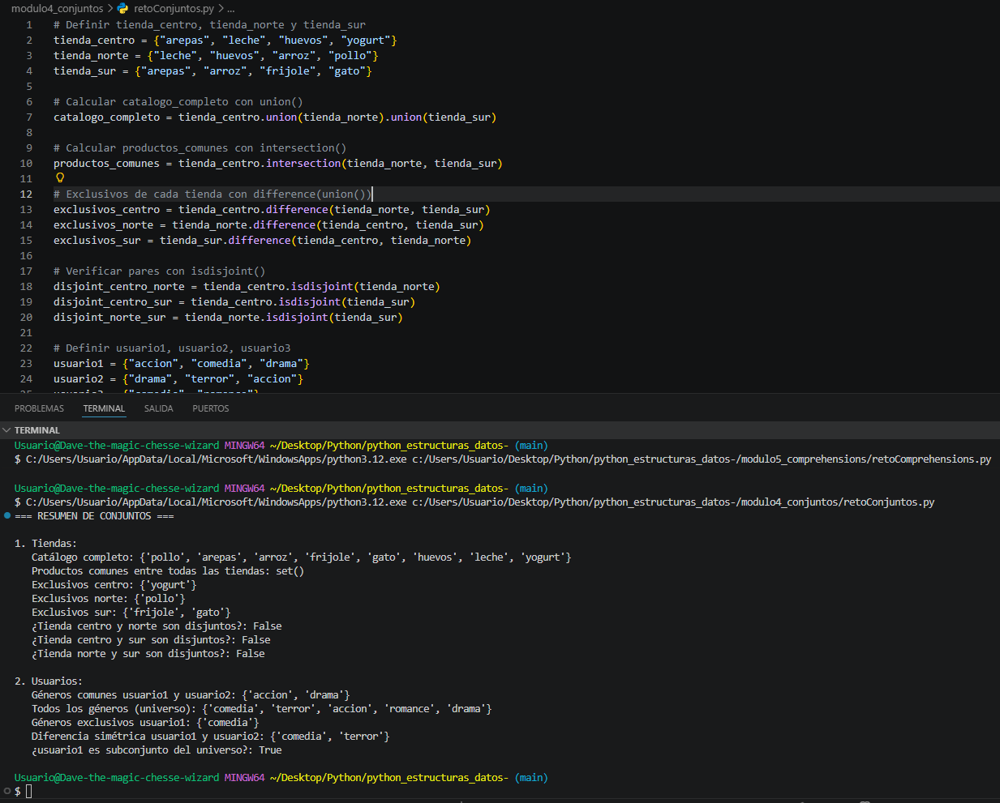
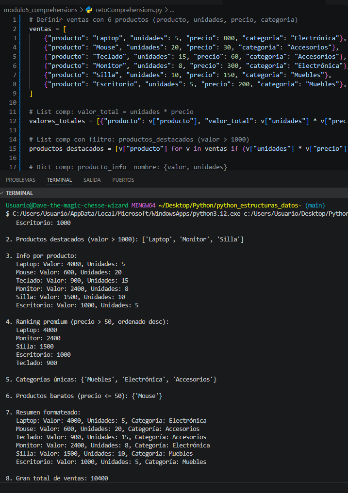

# Python Estructuras de Datos - Retos Prácticos
**Autor:** Cristian Giraldo Alvarez  
**Fecha:** Mayo 2026

---

## 1. Descripción del Proyecto
Este repositorio contiene una serie de retos prácticos diseñados para afianzar el conocimiento de las estructuras de datos nativas de Python. Se divide en 5 módulos independientes, cada uno enfocado en una estructura diferente:
- Módulo 1: Listas
- Módulo 2: Tuplas
- Módulo 3: Diccionarios
- Módulo 4: Conjuntos
- Módulo 5: Comprehensions

Cada módulo incluye un script `.py` con la solución del reto planteado y evidencia visual de su ejecución, integrando conceptos teóricos con casos de uso reales.

---

## 2. Temas Aprendidos

### Módulo 1: Listas
**Conceptos clave:** Mutabilidad de listas, indexación, métodos `append()`, funciones de gestión de datos.  
**Reto:** Implementar un sistema de inventario que permita actualizar precios, registrar ventas y añadir nuevos productos.  
**Evidencia:**  
  
*Captura que muestra en la parte superior (arriba) el código del reto de listas en VS Code, con la definición del inventario inicial, las funciones para gestionar el inventario (`actualizar_precio`, `registrar_venta`, `añadir_producto`, `mostrar_inventario`) y las llamadas a estas funciones. En la parte inferior (abajo), la ejecución en CMD muestra: 1) Mensaje de venta registrada de 3 unidades de Queso, 2) Confirmación de adición del producto Mantequilla (1000 unidades, precio 7800), 3) Listado final del inventario con 4 productos, donde se refleja el precio actualizado de Leche a 1880 y las 9 unidades restantes de Queso.*

---

### Módulo 2: Tuplas
**Conceptos clave:** Inmutabilidad de tuplas, desempaquetado de elementos, operador `*`, cálculo de estadísticas.  
**Reto:** Gestionar un catálogo de películas que permita búsqueda por director y cálculo de puntuación mínima, máxima y promedio.  
**Evidencia:**  
  
*Captura que muestra en la parte superior (arriba) el código de tuplas en VS Code, con el catálogo de películas, funciones de búsqueda y estadísticas. En la parte inferior (abajo), la ejecución en CMD muestra: 1) Películas del director "torontino", 2) Estadísticas de puntuación: mínima 5, máxima 10, promedio 8.25.*

---

### Módulo 3: Diccionarios
**Conceptos clave:** Estructura clave-valor, diccionarios anidados, métodos `items()` y `values()`, dict comprehensions.  
**Reto:** Analizar ventas por región y trimestre, calculando totales, región con mayores ventas y porcentajes de participación.  
**Evidencia:**  
  
*Captura que muestra en la parte superior (arriba) el código de diccionarios en VS Code, con la estructura de ventas por región y trimestre. En la parte inferior (abajo), la ejecución en CMD muestra: 1) Totales por región, 2) Región con mayores ventas (Bello: 7000), 3) Totales por trimestre, 4) Gran total y 5) Porcentajes de participación.*

---

### Módulo 4: Conjuntos
**Conceptos clave:** Operaciones de conjuntos `union()`, `intersection()`, `difference()`, `isdisjoint()`, operadores `& | - ^`.  
**Reto:** Gestionar catálogos de productos de tres tiendas y preferencias de géneros de usuarios, aplicando operaciones de conjuntos.  
**Evidencia:**  
  
*Captura que muestra en la parte superior (arriba) el código de conjuntos en VS Code, con las operaciones de tiendas y usuarios. En la parte inferior (abajo), la ejecución en CMD muestra el resumen completo: 1) Catálogo completo de productos, 2) Productos comunes, 3) Exclusivos por tienda, 4) Disjuntos, 5) Géneros de usuarios y 6) Operaciones con conjuntos de usuarios.*

---

### Módulo 5: Comprehensions
**Conceptos clave:** List/dict/set comprehensions, filtros condicionales, ordenamiento con `sorted()` y `lambda`.  
**Reto:** Analizar ventas de productos implementando 7 tipos de comprehensions para generar valores totales, productos destacados, ranking premium y más.  
**Evidencia:**  
  
*Captura que muestra en la parte superior (arriba) el código de comprehensions en VS Code, con las 7 implementaciones de list/dict/set comprehensions. En la parte inferior (abajo), la ejecución en CMD muestra: 1) Valores totales por producto, 2) Productos destacados (valor > 1000), 3) Info por producto, 4) Ranking premium ordenado, 5) Categorías únicas, 6) Productos baratos y 7) Gran total de ventas.*

---

## 3. Evidencia de Retos Resueltos
Todos los retos han sido implementados y ejecutados correctamente, sin errores en la consola:
- ✅ Módulo 1: Sistema de inventario con operaciones CRUD completas
- ✅ Módulo 2: Catálogo de películas con búsqueda y estadísticas funcionales
- ✅ Módulo 3: Análisis de ventas con cálculos de totales y porcentajes correctos
- ✅ Módulo 4: Todas las operaciones de conjuntos ejecutadas exitosamente
- ✅ Módulo 5: 7 tipos de comprehensions implementadas y probadas

---

## 4. Reflexión Personal del Aprendizaje
- **Aprendizaje adquirido:** He logrado dominar el uso de las estructuras de datos nativas de Python, entendiendo sus características, ventajas y casos de uso apropiados para cada una.
- **Reto más difícil:** El Módulo 5 (Comprehensions) fue el más complejo, debido a la sintaxis de filtros, el uso de `lambda` para ordenamiento y la combinación de diferentes tipos de comprehensions.
- **Aplicación futura:** Estos conocimientos me permitirán gestionar datos de manera eficiente, realizar análisis de información y automatizar tareas en proyectos de desarrollo de software.
- **Conclusión:** La práctica modular con casos de uso reales es fundamental para afianzar conceptos teóricos y adquirir experiencia práctica en programación.
